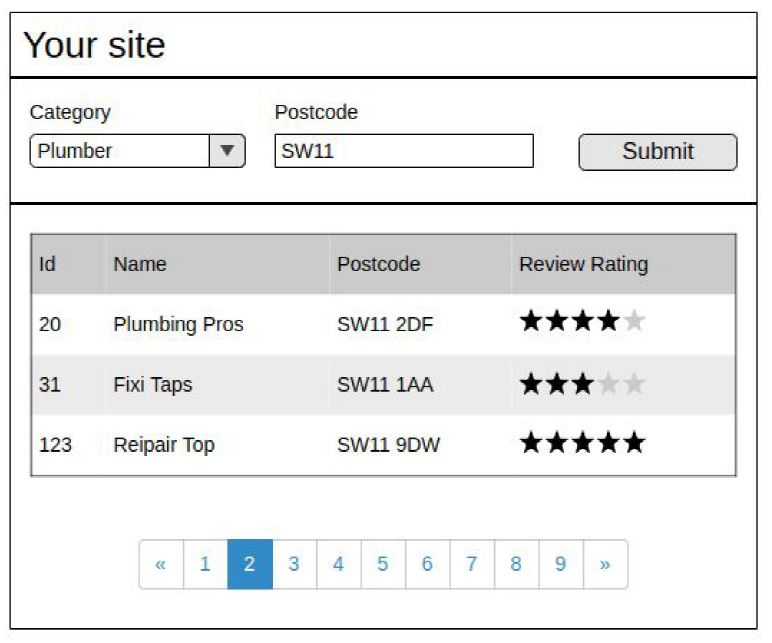
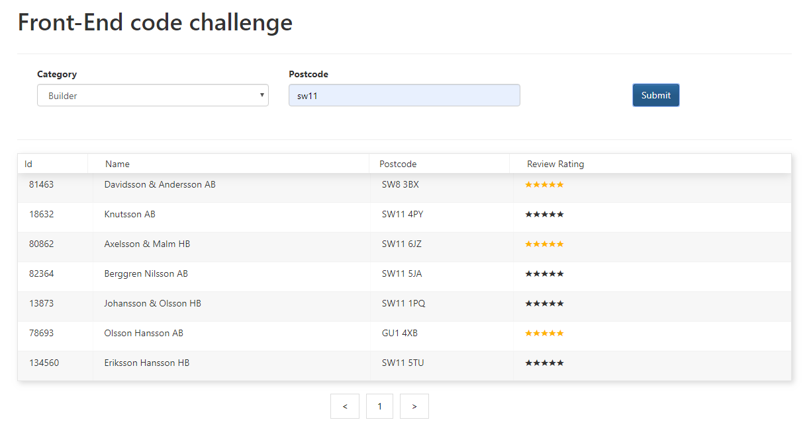

# Code-challenge - Search professional case study

 
 
 

 

### Requirements

The coding challenge is to create a single-page app using React.js and some Demo API.
The frontend React app is a Search professional page, the desired project output is the image below:

- Listing the pros in a table including the columns shown in the wireframe.
- Using a Demo API.
- Using pagination if the results are more than 20(each page  have a max of 20 results), if no records hide pagination.

### Focus points

- correctness of implementation
- unit tests and business logic
- code best practices
- use of code quality enhancer such as linters and code formatter
- documentation: README and inline code comments

### Result

### react-frontend-code-challenge 

This project was bootstrapped with [Create React App](https://github.com/facebook/create-react-app).

### Available Scripts

In the project directory, you can run:

#### `npm start`

Runs the app in the development mode. 
Open [http://localhost:3000](http://localhost:3000) to view it in the browser.

#### `npm test`

Launches the test runner in the interactive watch mode. 
See the section about [running tests](https://facebook.github.io/create-react-app/docs/running-tests) for more information.

